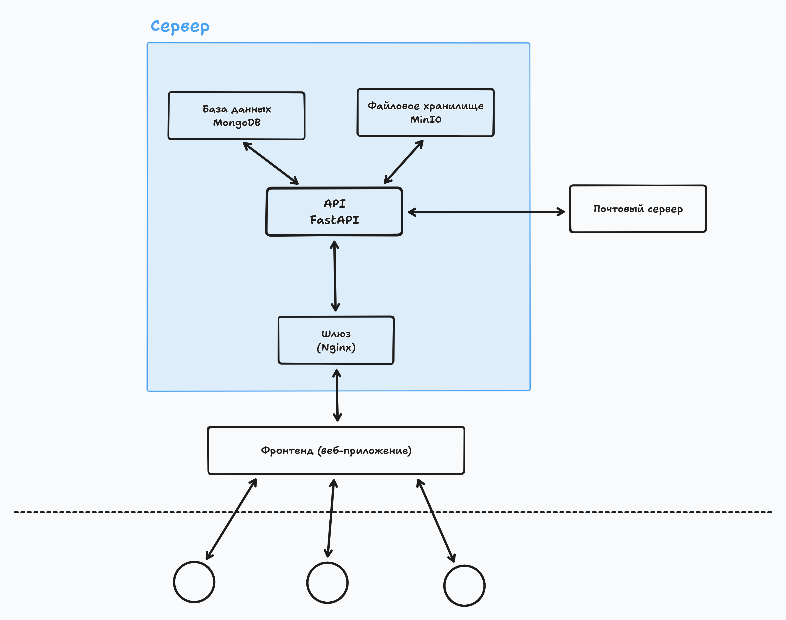

# ФСП Линк

> Команда one-zero-eight

**Развернутый проект: https://champ.innohassle.ru**

- Видео-презентация: -
- Видео-демонстрация: -
- Презентация: -
- Репозиторий: https://github.com/hackathonsrus/pp_final_50040_pfo_ta_onezeroeight_69

## Описание

ФСП Линк - это современная цифровая платформа, разработанная для управления спортивными соревнованиями и обеспечения информационной поддержки федераций.
Наша цель - объединить все региональные федерации и общероссийскую федерацию в едином информационном пространстве.

Личный кабинет представителя региональной федерации:
- Эффективная панель управления для просмотра важной информации о федерации
- Создание и редактирование соревнований, в том числе загрузка результатов соревнований
- Отправка заявок на включение мероприятий в общий календарь
- Редактирование информации о федерации
- Отправка запросов администратору

Личный кабинет общероссийской федерации:
- Удобная административная панель для управления всеми соревнованиями и федерациями
- Просмотр и редактирование информации о региональных федерациях
- Подтверждение или отклонение заявок на добавление региональных федераций
- Просмотр и редактирование информации о соревнованиях
- Подтверждение или отклонение заявок на включение мероприятий в общий календарь
- Просмотр запросов от региональных федераций
- Аналитика по региональным федерациям и соревнованиям

Публичные страницы для всех пользователей:
- Просмотр календаря соревнований
- Просмотр дисциплин спортивного программирования
- Просмотр информации о всех региональных федерациях

## Архитектура сервиса

Используется база данных MongoDB для легкого горизонтального масштабирования.
Для хранения пользовательских файлов запускается MinIO, который позволит легко расширить хранилище при необходимости.
Сервер FastAPI запускается через менеджер процессов Gunicorn, который способен запускать несколько воркеров для обработки запросов, что позволяет обрабатывать большое количество запросов.
Модульная архитектура приложения позволяет легко добавлять новый функционал и улучшать существующий.
Фронтенд выполнен на React с декомпозицией на компоненты для удобства разработки и поддержки.
В качестве шлюза используется Nginx, который сможет обрабатывать большое количество запросов и распределять их между серверами при необходимости.



## Инструкция по локальному запуску

Протестировано на Ubuntu 22.04 с архитектурой amd64.

1. Установить [Docker и Docker Compose](https://docs.docker.com/engine/install/) последней версии.
2. Склонировать этот репозиторий (или скачать zip архив) и перейти в папку с проектом.
3. Запустить проект.
   ```
   docker compose up -d --build
   ```
4. Зайти на [http://localhost:8000](http://localhost:8000) в браузере.
